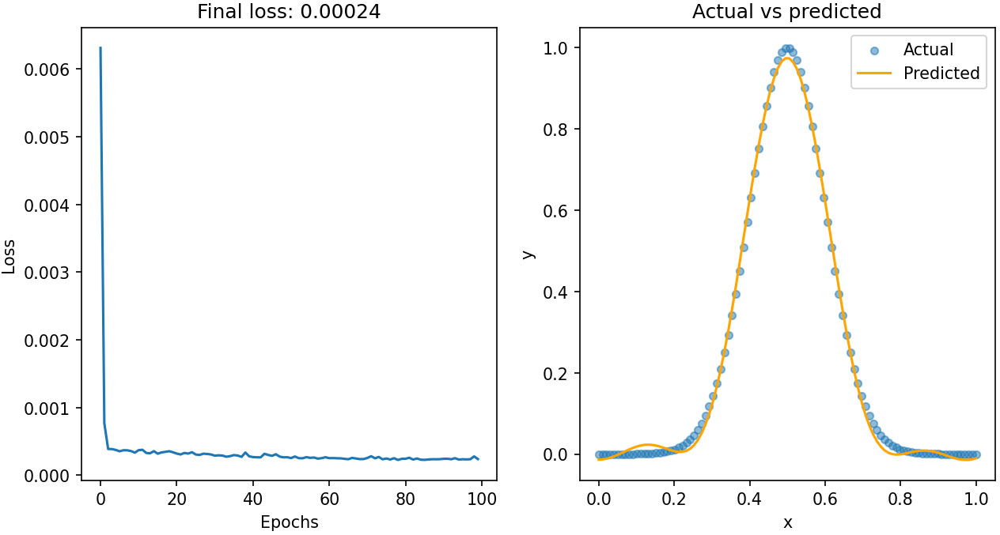
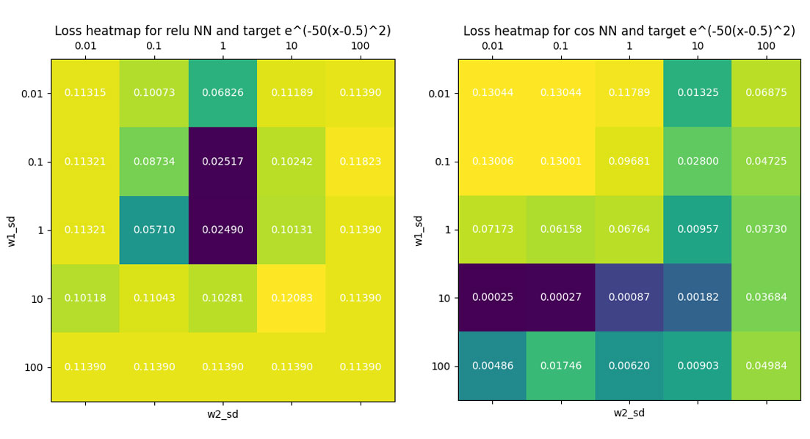
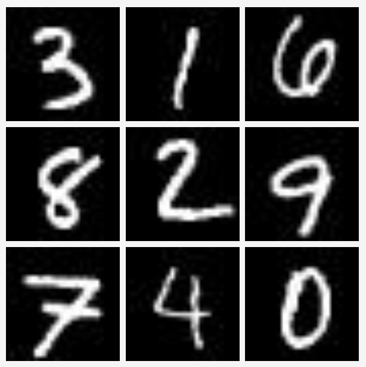

# Approximation Properties of Neural Networks

Neural networks (NN) can have different activation functions. By far the most common activation function is the rectified linear unit (ReLU).

However, we can consider other more "exotic" activation functions like the cosine.

The cosine is chosen because results in <a href="https://ieeexplore.ieee.org/document/256500">Barron (1993)</a> and <a href="https://pure.psu.edu/en/publications/finite-neuron-method-and-convergence-analysis">Xu (2020)</a> show that some target functions can be more naturally expressed in terms of cosine functions, and hence, can be well approximated by NNs with cosine activation.

Therefore, we run some tests on single layer NNs and see that in some circumstances, networks with cosine activation can indeed outperform networks with ReLU activation.

## Table of contents
* [Regression](#demo)
* [Classification](#general-info)
* [The MNIST dataset](#the-mnist-dataset)
* [Run the code](#run-the-code)
* [References](#references)

## Regression

A single hidden layer NN with 32 nodes was trained with learning rate 0.01 using SGD on 100 data points and 100 epochs.

When the weights are initialized correctly, the cosine activated NN outperforms the ReLU activated NN on fitting a variety of target functions. The example for target function $f(x)=x\sin{4\pi x}$ is shown below.

The ReLU network with weights initialized with the standard normal $N(0,1)$ does not fit the function well.

The cosine network with weights initialized as $N(0, 10^2)$ and $N(0,0.1^2)$ for the first and second layers respectively gives a much better fit.

These weight initializations (with the specific target function and NN architecture) are optimal among the choices tested (see the figure below).

The idea behind using different weight initializations is based on <a href="https://www.researchgate.net/publication/3835580_Neural_networks_with_periodic_and_monotonic_activation_functions_a_comparative_study_in_classification_problems">this paper</a> by Sopena et al. (1999).

They investigated suitable initializations for NNs with sine activation instead, and reasoned that such initializations are better suited for the non-monotonic nature of the activation function, thus decreasing the probability of falling into a local minimum.

## The MNIST dataset

Single hidden layer NNs with similar architecture, except with input dimension 784 and 1024 nodes in the hidden layer were trained to classify digits from the MNIST dataset.

Again, with proper initialization of the weights for the two layers: $N(0, 0.1^2)$, $N(0, 0.01^2)$, the cosine NN outperformed the ReLU NN.

Each network was trained and evaluated 10 times.

The mean test accuracy for the NNs with ReLU activation is $0.973$, with a standard deviation of $1.197\times 10^{-3}$. 

The cosine activated NNs achieved a mean accuracy of $0.976$ and a standard deviation of $7.584\times 10^{-4}$.

This difference is statistically significant $(t_{18}=5.647,  p=2.34\times 10^{-5})$.

## Run the code

Clone the repository and run `main.py`.

For a more in-depth look at how each component of the neural network functions, run a simplified version of the code inside `demo.py`. In practice, the NN is identical to the one inside `main.py`.

## References

The code inside the directory `lib` is adapted from the book <a href="https://nnfs.io/">Neural Networks from Scratch in Python</a>.

The MNIST dataset in the directory `data` was downloaded from the following source: <a href="http://yann.lecun.com/exdb/mnist/">http://yann.lecun.com/exdb/mnist/</a>.
